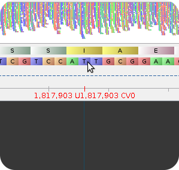
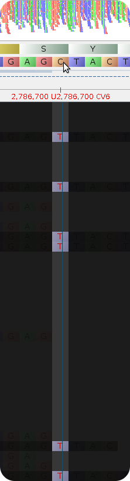

Tutorial 1 Answers
==================

Question 1
----------

The reference mapping alignment BAM files for each genome are located within __tutorial1_out/bam__.  Load one of these files up using software such as [Tablet](http://bioinf.scri.ac.uk/tablet/) and examine the two missing positions 1817903 and 2786700.  What do you notice about these positions?

In Tablet position 1817903 for file *tutorial1_out/bam/08-5578-0.bam* looks as follows:

This indicates that no reads have mapped to this position.  This is most likely due to this position lying within a repeat region, and we have selected to not map reads with multiple best mapping scores (the '-1' parameter within the __smalt_map__ section of _mapping.conf_.  This can be verified using [MUMMer](http://mummer.sourceforge.net/manual/#identifyingrepeats) with the following commands:

	$ nucmer --maxmatch --nosimplify --prefix=08_5578_08_5578 reference/08-5578.fasta reference/08-5578.fasta
	$ show-coords -r 08_5578_08_5578.delta
	/home/aaron/Projects/software/core-phylogenomics-tutorial/reference/08-5578.fasta /home/aaron/Projects/software/core-phylogenomics-tutorial/reference/08-5578.fasta
	NUCMER
	
	    [S1]     [E1]  |     [S2]     [E2]  |  [LEN 1]  [LEN 2]  |  [% IDY]  | [TAGS]
	=====================================================================================
	       1  3032288  |        1  3032288  |  3032288  3032288  |   100.00  | gi|284800255|ref|NC_013766.1|        gi|284800255|ref|NC_013766.1|
	   52653    52925  |    54424    54696  |      273      273  |    79.56  | gi|284800255|ref|NC_013766.1|        gi|284800255|ref|NC_013766.1|
	   53847    54071  |    54350    54576  |      225      227  |    88.11  | gi|284800255|ref|NC_013766.1|        gi|284800255|ref|NC_013766.1|
	...

The generated table lists all reptitive regions on the reference genome *reference/08-5578.fasta*, in the format of (start1, end1) and (start2, end2).  Scrolling through this table indicates that (1816674, 1818474) is nearly identical to (265488,263688) and (2556319,2558119).  The position 1817903 lies within this region and so most likely excluded from the reference mapping results.

In Tablet, position 2786700 for file *tutorial1_out/bam/08-5578-0.bam* looks as follows:

This indicates that there were 6 reads which support a C -> T mutation at this position, which is greater than the minimum cutoff of 5.  However, the __freebayes_params__ section of the _mapping.conf_ file includes parameters like __--min-base-quality 30 --min-mapping-quality 30__.  These indicate that only reads which pass these criteria will be counted towards a result.  Most likely, at least one of the reads mapped to this position does not pass these critera, reducing the coverage from 6 to below the threshold need to call a variant.

Question 2
----------

For this tutorial the mean coverage simulated was 30x, and our minimum SNP detection coverage was 5x.  Try changing the minimum coverage to 15x and 25x within the file __mapping.conf__ and re-running the pipeline.  Compare the differences in the number of SNPs detected.  How does the number of SNPs detected change as the minimum coverage increases?

From the table below, it can be observed that as the __min_coverage__ increases, the number of SNPs detected decreases.  This is because the coverage set within the simulations, 30x, is only the mean coverage, which may vary across the genome.

| Coverage | Positions Detected |
| -------- | ------------------ |
|        5 |                 98 |
|       15 |                 27 |
|       25 |                  0 |

The steps used to generate the above table are given below.

In order to change the minimum coverage, the __min_coverage__ must be changed within the _mapping.conf_ file.  Please create two new files, mapping.15.conf and mapping.25.conf, change this value, then run the pipeline for each case (note the --output to different directories, and --config to different config files).

	$ snp_phylogenomics_control --mode mapping --input-dir tutorial1_fastq/ --reference reference/08-5578.fasta --output tutorial1_out_15 --config mapping.15.conf
	$ snp_phylogenomics_control --mode mapping --input-dir tutorial1_fastq/ --reference reference/08-5578.fasta --output tutorial1_out_25 --config mapping.25.conf

To look at the differences in the number of SNPs identified, the __scripts/generate_genomes.pl__ command can be used.  Please run as follows:

	$ perl scripts/compare_positions.pl tutorial1_mutations.tsv tutorial1_out_15/pseudoalign/pseudoalign-positions.tsv | column -t
	tutorial1_mutations.tsv  tutorial1_out_15/pseudoalign/pseudoalign-positions.tsv  Intersection  Unique-tutorial1_mutations.tsv  Unique-tutorial1_out_15/pseudoalign/pseudoalign-positions.tsv
	100                      27                                                      27            73                              0
	
	$ perl scripts/compare_positions.pl tutorial1_mutations.tsv tutorial1_out_25/pseudoalign/pseudoalign-positions.tsv | column -t
	tutorial1_mutations.tsv  tutorial1_out_25/pseudoalign/pseudoalign-positions.tsv  Intersection  Unique-tutorial1_mutations.tsv  Unique-tutorial1_out_25/pseudoalign/pseudoalign-positions.tsv
	100                      0                                                       0             100                             0

Compiling these results together results in the above table.

Question 3
----------

All the fastq files we generated were simulated with 100 bp reads.  Adjust the read length using the __--len__ parameter in the __scripts/generate_genomes.pl__ script to 50x and 200x.  What difference does this make to the number of SNPs detected?

From the table below it can be seen that as we increase the read length the number of positions detected increases.  This is most likely due to the ability of longer reads to span more repetitive regions and so unambiguously map to the correct location.

| Read Length | Positions Detected |
| ----------- | ------------------ |
|          50 |                 94 |
|         100 |                 98 |
|         200 |                 99 |

The steps used to generate the above table are given below.

To generate reads at 20x and 200x, we adjust the _--len_ parameter within the __genreate_genomes.pl__ script.  The commands used are (note the different out_dir parameter):

	$ perl scripts/generate_genomes.pl reference/08-5578.fasta tutorial1_mutations.tsv '--len 50 --fcov 30 --noALN --rndSeed 1' tutorial1_fastq_50
	$ perl scripts/generate_genomes.pl reference/08-5578.fasta tutorial1_mutations.tsv '--len 200 --fcov 30 --noALN --rndSeed 1' tutorial1_fastq_200

Now, we run the pipeline (using 5x minimum coverage) for each set of FASTQ files generated above.

	$ snp_phylogenomics_control --mode mapping --input-dir tutorial1_fastq_50/ --reference reference/08-5578.fasta --output tutorial1_out_len_50 --config mapping.conf
	$ snp_phylogenomics_control --mode mapping --input-dir tutorial1_fastq_200/ --reference reference/08-5578.fasta --output tutorial1_out_len_200 --config mapping.conf

Now, we run __scripts/compare_positions.pl__ to compare the positions identified.

	$ perl scripts/compare_positions.pl tutorial1_mutations.tsv tutorial1_out_len_50/pseudoalign/pseudoalign-positions.tsv | column -t
	tutorial1_mutations.tsv  tutorial1_out_len_50/pseudoalign/pseudoalign-positions.tsv  Intersection  Unique-tutorial1_mutations.tsv  Unique-tutorial1_out_len_50/pseudoalign/pseudoalign-positions.tsv
	100                      94                                                          94            6                               0

	$ perl scripts/compare_positions.pl tutorial1_mutations.tsv tutorial1_out_len_200/pseudoalign/pseudoalign-positions.tsv | column -t
	tutorial1_mutations.tsv  tutorial1_out_len_200/pseudoalign/pseudoalign-positions.tsv  Intersection  Unique-tutorial1_mutations.tsv  Unique-tutorial1_out_len_200/pseudoalign/pseudoalign-positions.tsv
	100                      99                                                           99            1                               0
	
Now, compile these results together into the table seen above.
